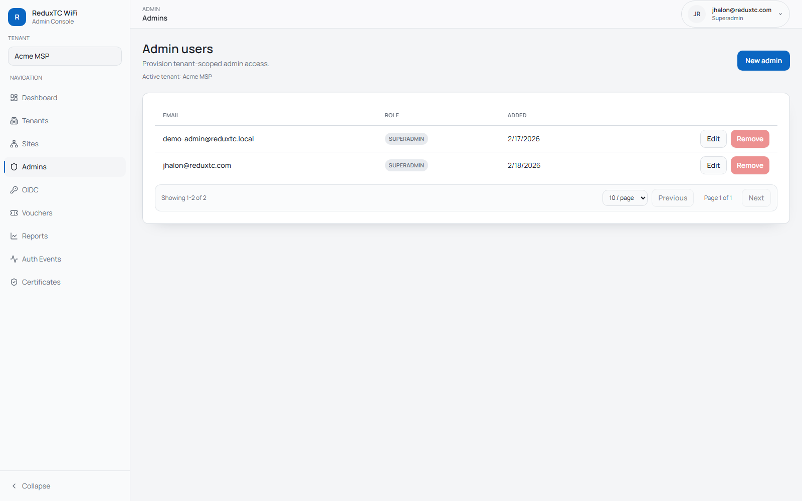

# Admin Users & Roles

Use this page to grant or revoke staff access to the admin console.

## Role model

- `Tenant Admin`: manage sites, vouchers, OIDC, and reporting for assigned tenant(s)
- `Tenant Viewer`: read-only access for assigned tenant(s)
- `Superadmin`: full platform access across all tenants

## Create an admin user

1. Open `Admin -> Admins`.
2. Confirm the tenant selector is set correctly.
3. Click `New admin`.
4. Enter email, password, and role.
5. Save.

## Edit an existing admin

1. In `Admin -> Admins`, select `Edit` for the user row.
2. Update email, role, password, or superadmin status.
3. Save.

## Remove access

1. In `Admin -> Admins`, select `Remove`.
2. Confirm deletion.

Operational note:
If you remove privileged staff, rotate shared credentials (UniFi key, SMTP secret, OIDC client secret).
