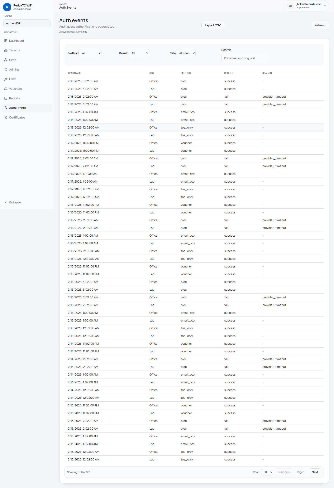
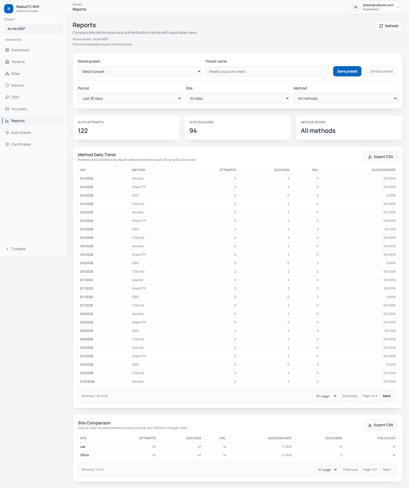

# Auth Events & Reporting

Use these pages for operations, customer reporting, and incident follow-up.

## Auth Events workflow

1. Go to `Admin -> Auth Events`.
2. Set filters:
   - method (`voucher`, `email_otp`, `oidc`, `tos_only`)
   - result (`success`, `fail`)
   - site
   - free-text search
3. Page through records with row count and next/previous controls.
4. Export CSV when needed.

## Reports workflow

1. Go to `Admin -> Reports`.
2. Choose period and optional site/method filters.
3. Review method trend and site comparison tables.
4. Save filter presets for repeat reporting.
5. Export CSV from each report section.

## Incident triage sequence

If a guest says they could not connect:
1. Search in `Auth Events` by email, reason, or session fields.
2. Confirm failure method and site.
3. Open site settings and verify UniFi/SSO/SMTP configuration.
4. Use `Reports` to check whether issue scope is single-site or broad.
