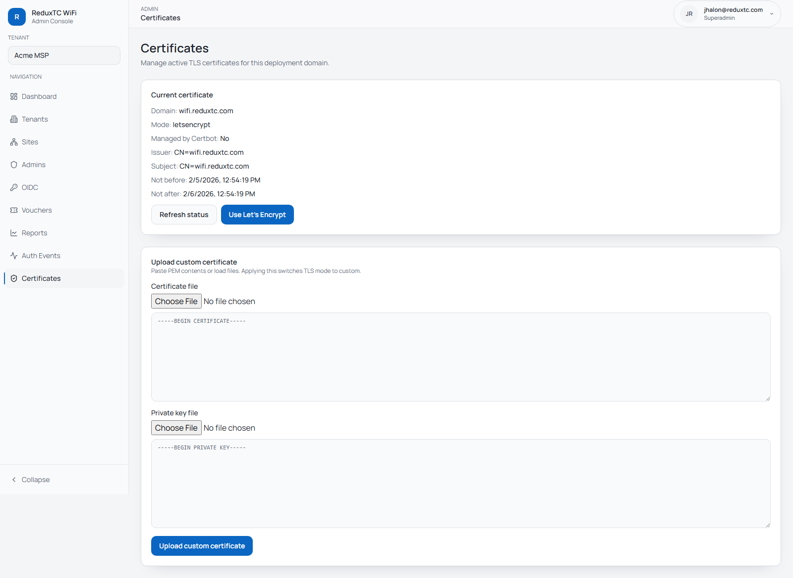

# Certificates & TLS

This page covers TLS certificate management for superadmins.

> Certificates is now part of `Admin -> Settings -> Certificates tab`.
> The old standalone route (`/admin/certificates`) redirects to Settings automatically.

## What it manages

- current TLS certificate status
- active mode (`letsencrypt` or `custom`)
- certificate validity window
- custom PEM certificate and private key upload

## Switch to Let's Encrypt mode

1. Open `Admin -> Settings -> Certificates tab`.
2. Click `Use Let's Encrypt`.
3. Click `Refresh status` and confirm issuer/expiry values.

Use this mode when your domain and certbot automation are healthy.

## Upload a custom certificate

1. Open `Admin -> Settings -> Certificates tab`.
2. Paste or upload certificate PEM.
3. Paste or upload private key PEM.
4. Click `Upload custom certificate`.
5. Refresh status and confirm validity dates.

This changes TLS mode to `custom`.

## Operational checks

- Confirm certificate `Not after` date is in the future.
- If browsers still warn, verify DNS points to the expected host and nginx has reloaded.
- For deployment-level setup, see [Production Deployment](deployment-ubuntu20-digitalocean.md).
