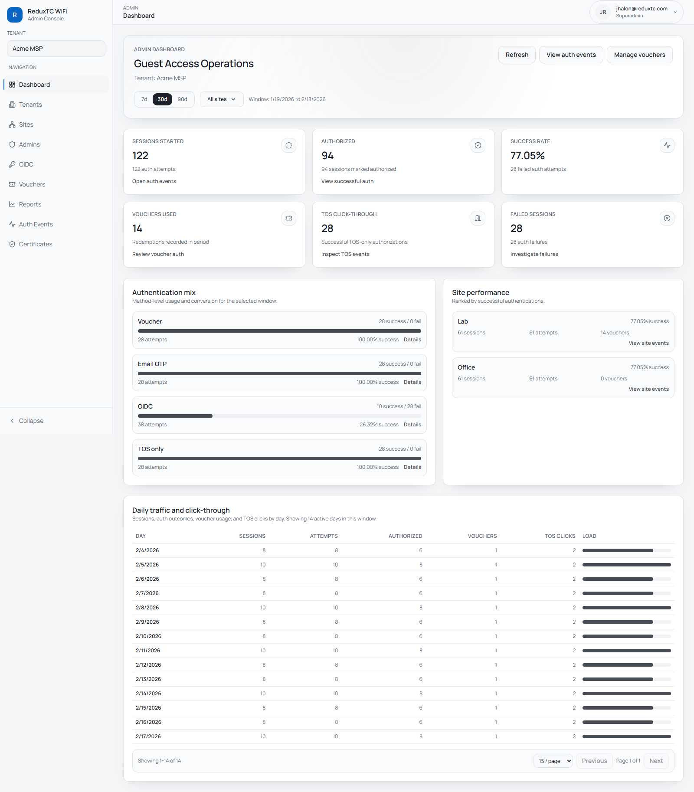
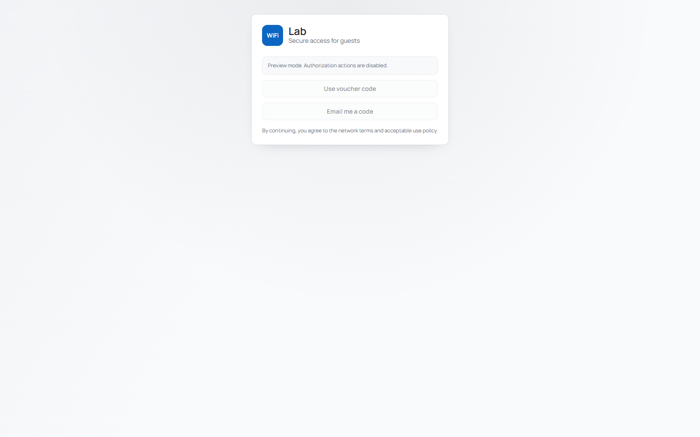

# ReduxTC WiFi Portal Documentation

This documentation is for operators who manage tenant WiFi access in production.

Screenshots in this guide were captured from the live app on February 18, 2026.

## Start here

1. Deploy the platform:
   - [Cheat Sheet (Production)](cheat-sheet.md)
   - [Production Deployment (Ubuntu 20.04 / DigitalOcean)](deployment-ubuntu20-digitalocean.md)
2. Onboard your first customer:
   - [Tenant Onboarding](tenant-onboarding.md)
   - [Site Setup Checklist](site-setup.md)
   - [UniFi Setup](unifi-setup.md)
3. Enable guest sign-in methods:
   - [Vouchers](vouchers.md)
   - [Email OTP (SMTP)](email-otp-smtp.md)
   - [OIDC SSO (Microsoft Entra ID)](oidc-m365.md)
4. Operate day to day:
   - [Auth Events & Reporting](auth-events.md)
   - [Troubleshooting](troubleshooting.md)
   - [Operations & Security](operations-security.md)

## What this platform does

ReduxTC hosts an external captive portal for UniFi Hotspot networks.

A guest joins WiFi, completes an auth flow, and ReduxTC calls UniFi to authorize internet access.

- Tenant and site isolation for MSP operations
- Voucher, email OTP, OIDC SSO, and terms-only auth options
- Admin UI for tenants, sites, policies, vouchers, IdPs, reports, and certificates
- Audit trail with CSV export

## Product views

### Admin dashboard

### Guest portal preview

