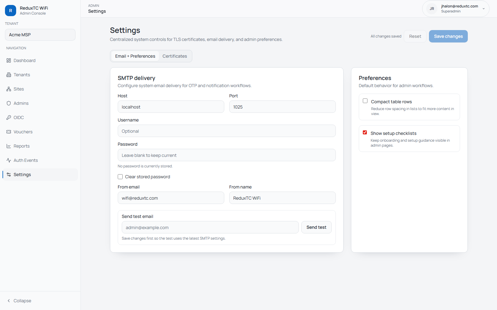
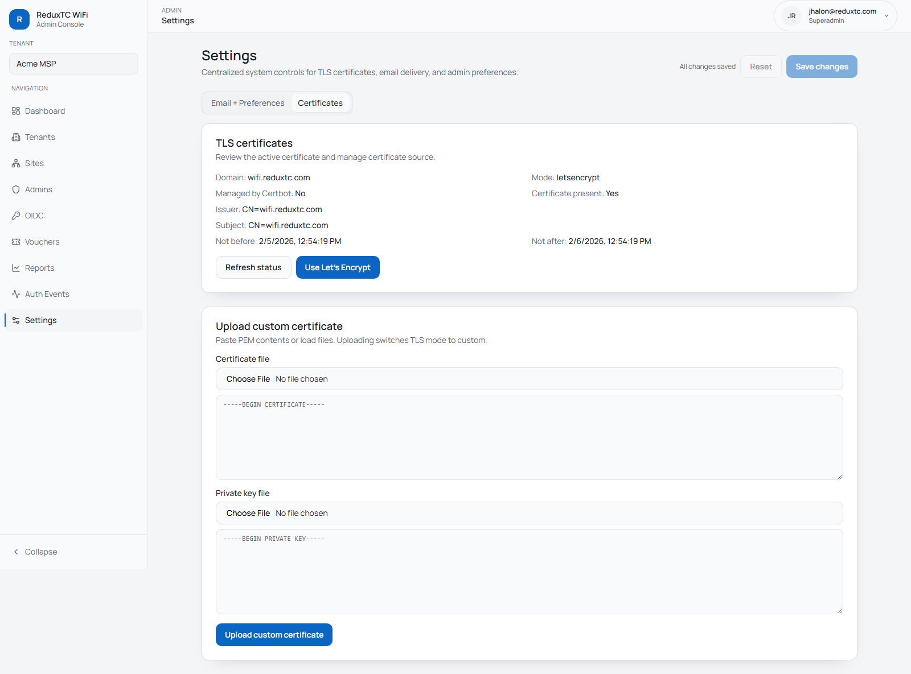

# System Settings (Superadmin)

`Settings` is now the centralized system administration area.

Route:
- `Admin -> Settings`
- URL: `/admin/settings`

`Certificates` has been deprecated as a standalone nav item. The old route (`/admin/certificates`) redirects to Settings.

## What you can manage

- SMTP delivery settings for OTP and system email workflows
- Admin UI preferences (`compact_tables`, `show_setup_checklists`)
- TLS certificate status and certificate source (Let's Encrypt or custom upload)

## Email + Preferences tab

Use this tab to configure SMTP host/port/identity, store or clear SMTP password, run test email, and set admin UI behavior defaults.



## Certificates tab

Use this tab to:
- review certificate metadata (`issuer`, `subject`, validity dates)
- switch certificate mode to Let's Encrypt
- upload custom PEM certificate and private key



## Operational note

If Settings loads with missing values or errors after upgrade, confirm migrations are current:

```bash
docker compose exec api alembic upgrade head
```
