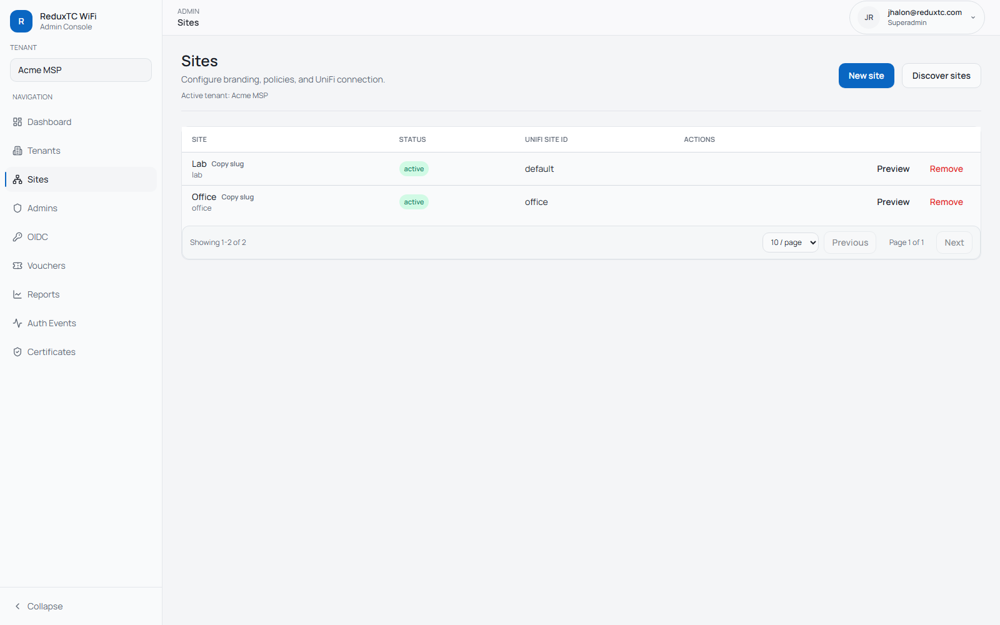
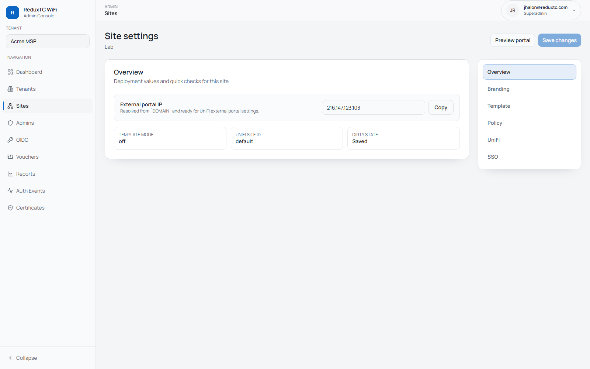
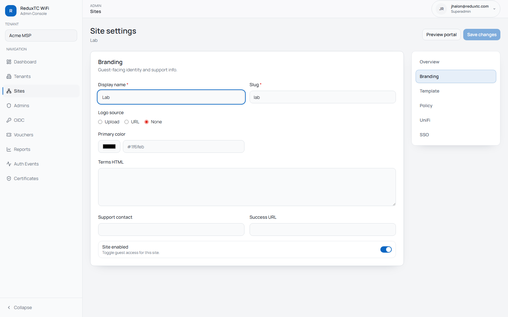
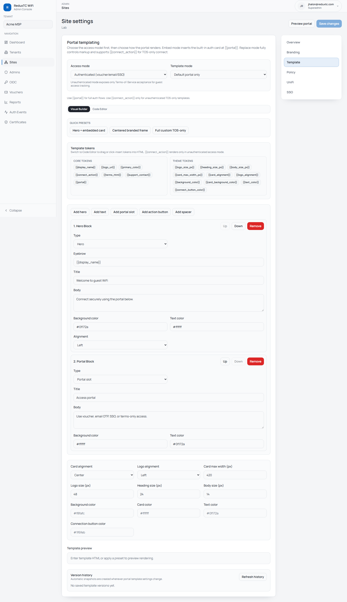
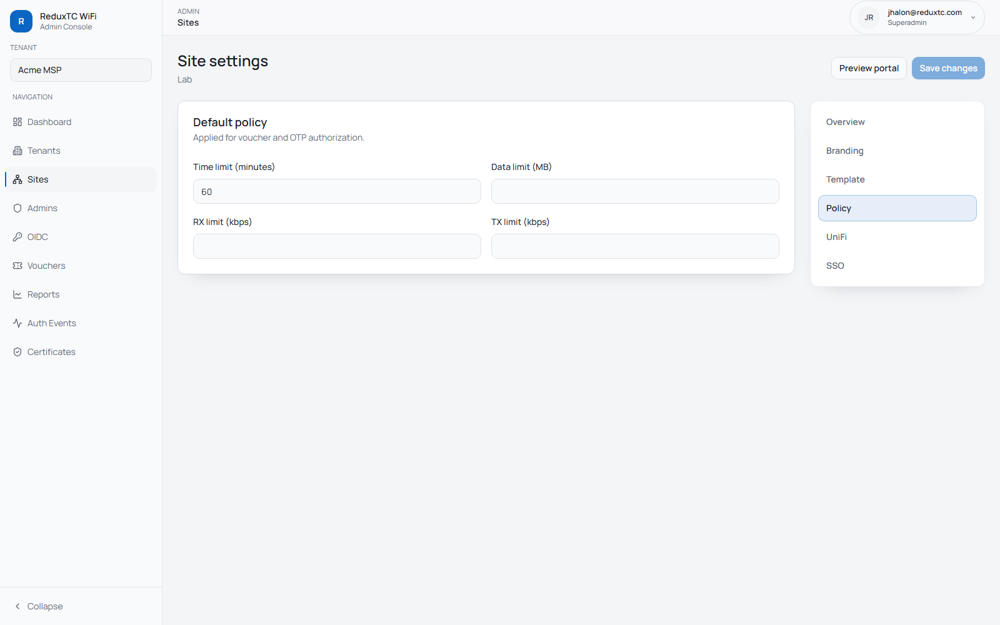
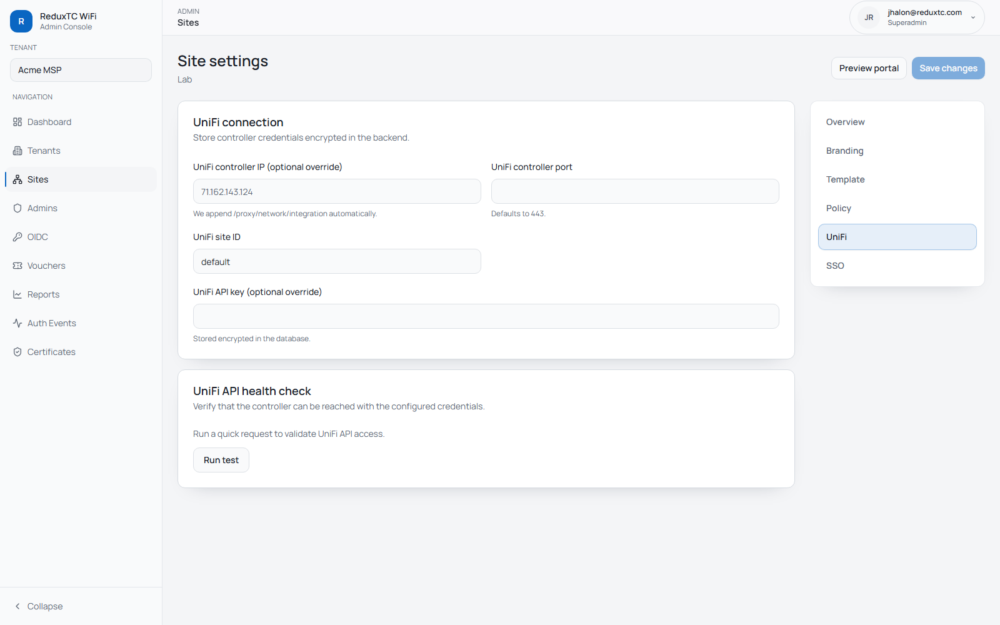
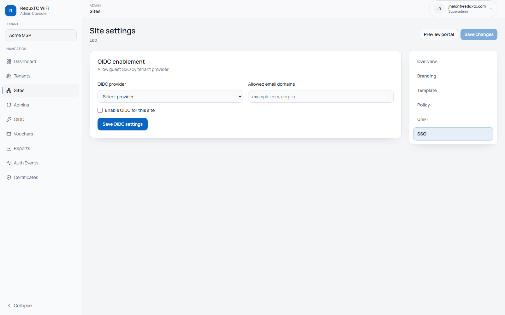

# Site Setup Checklist

A site controls location-level behavior for guest access.

## What a site configures

- branding and support contact
- portal template mode (`off`, `embed`, `replace`)
- guest policy defaults (time/data/rate limits)
- UniFi site mapping and connection overrides
- OIDC enablement and domain allowlist

## Open the site settings page

1. Go to `Admin -> Sites`.
2. Click `Preview` for the site you want to configure.

The site settings page uses a right-side section navigator:
- Overview
- Branding
- Template
- Policy
- UniFi
- SSO

## Configure each section

### Overview

Confirm:
- external portal IP
- template mode
- UniFi site ID
- dirty-state/save status

### Branding

Set logo URL, primary color, and support contact.

### Template

Set portal template mode and content:
- `off`: built-in portal only
- `embed`: custom layout with `{{portal}}` placeholder
- `replace`: fully custom HTML

### Policy

Set default policy values applied at authorize time:
- time limit minutes
- data limit MB (optional)
- RX/TX rate caps (optional)

### UniFi

Set site-level UniFi connection overrides only when needed.

If left empty, tenant-level UniFi settings are used.

### SSO

Enable OIDC for this site, select provider, and optionally set allowed domains.

## Save and verify

1. Click `Save changes`.
2. Use `Preview portal` to sanity-check the guest page.
3. Run a real guest flow on the SSID.
