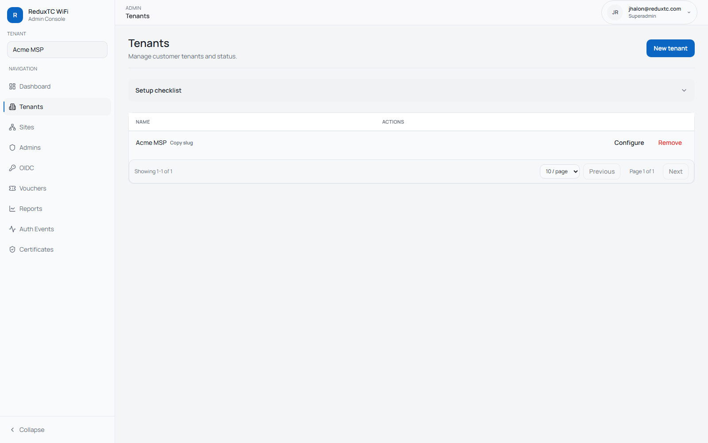

# Tenant Onboarding

This is the operator checklist for adding a new customer tenant.

## Before you start

Collect:
- tenant display name
- tenant slug (`acme`, `district-42`, etc.)
- UniFi controller host and port
- UniFi API key

## Step 1: Create the tenant

1. Go to `Admin -> Tenants`.
2. Click `New tenant`.
3. Set `Name`, `Slug`, and status.
4. Enter tenant-level UniFi defaults:
   - base URL
   - controller port
   - API key
5. Save.

## Step 2: Create the first site

1. Go to `Admin -> Sites`.
2. Click `New site`.
3. Set:
   - display name
   - slug
   - `UniFi site id` (commonly `default`)
4. Leave site enabled.
5. Save.

## Step 3: Validate the tenant

1. Open the created site record.
2. Confirm `UniFi site id` is correct.
3. Confirm UniFi connection details are present (site override or tenant defaults).
4. Confirm dashboard and reports load for that tenant.

Next:
- [Site Setup Checklist](site-setup.md)
- [UniFi Setup](unifi-setup.md)
- [Vouchers](vouchers.md), [Email OTP (SMTP)](email-otp-smtp.md), [OIDC SSO](oidc-m365.md)
