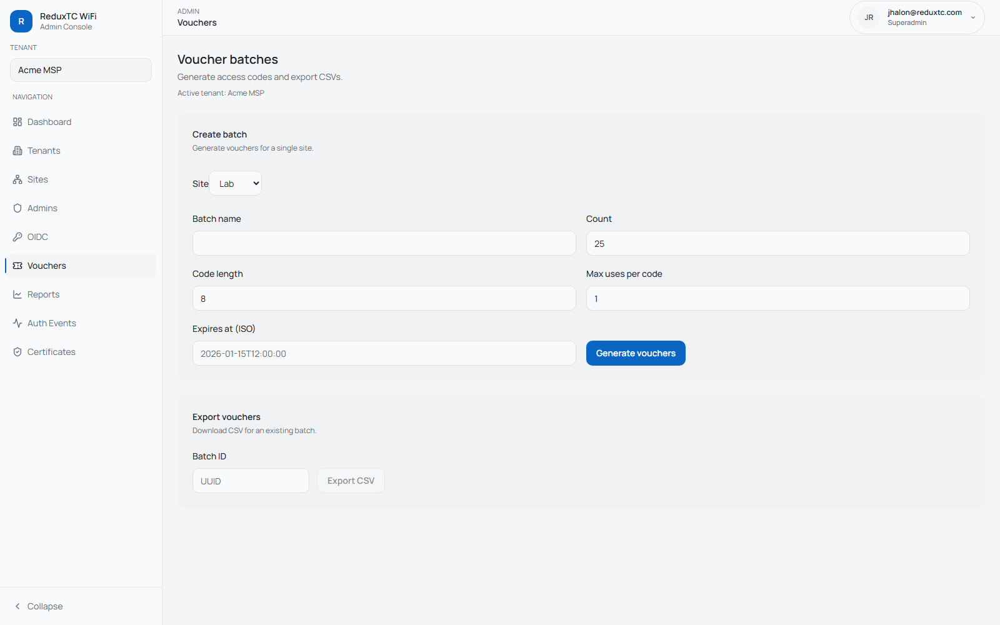

# Vouchers

Vouchers are staff-issued codes guests can redeem in the captive portal.

## Create a voucher batch

1. Open `Admin -> Vouchers`.
2. Confirm tenant scope.
3. Fill in:
   - batch name
   - target site
   - code count
   - code length
   - max uses per code
   - optional expiration
4. Click `Generate vouchers`.

## Export voucher codes

1. Copy the `Batch ID` from the creation response.
2. In the export form, paste the batch ID.
3. Click `Export CSV`.

## Guest flow

1. Guest joins WiFi.
2. Portal shows voucher field.
3. Guest enters code.
4. ReduxTC validates code and authorizes guest in UniFi.

## Quick troubleshooting

- `Invalid code`: wrong site, expired batch, or usage limit reached.
- `Code accepted but no internet`: verify UniFi base URL, API key, and site ID.
